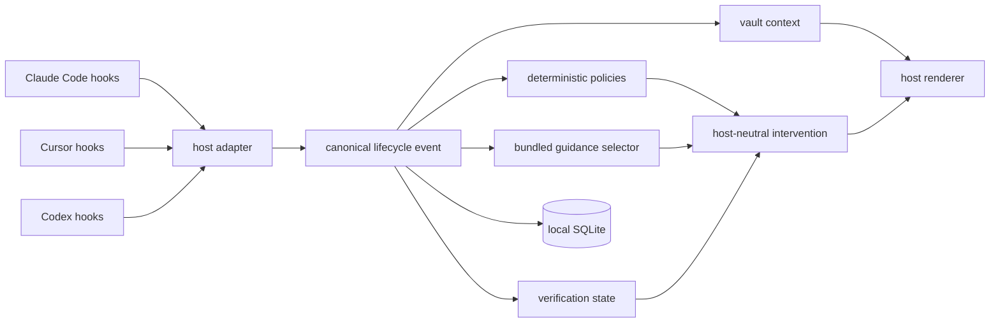

# Architecture

Agent Efficiency is one local runtime with thin adapters for Claude Code,
Cursor, and Codex.



The lifecycle path makes no model calls and no network requests. It uses the
Python standard library and local SQLite.

## Design goals

1. Preserve requested scope and quality.
2. Keep runtime behavior deterministic and bounded.
3. Store operational facts without storing work content.
4. Expose the same meaning across hosts with different lifecycle APIs.
5. Fail open when monitoring fails.
6. Match claims to measured evidence.

## Host adapters

Each adapter maps native host input to a canonical event:

```text
native event
  -> adapter normalization
  -> canonical event and capabilities
  -> policy and guidance selection
  -> canonical effect
  -> host-native response
```

Canonical events include:

- `SessionStart`
- `UserPromptSubmit`
- `PreToolUse`
- `PostToolUse`
- `PostToolUseFailure`
- `PostToolBatch`
- `PreCompact`
- `PostCompact`
- `Stop`
- `SessionEnd`

An adapter also declares the effects supported for each event. Common effects
are:

- add context;
- notify;
- continue a stopped turn;
- deny an action;
- replace an action.

The renderer never assumes that every host supports every effect. A missing
effect becomes a notification or no action, based on the policy contract.

## Canonical facts

The runtime reduces native event data to controlled facts:

- host and lifecycle event;
- task class and risk class;
- action class and one-way action fingerprint;
- code-edit and validation flags;
- failure, repetition, scan, subagent, and compaction counters;
- supported host effects;
- elapsed local runtime;
- optional host-provided cost and token totals.

Prompt bodies, commands, code, outputs, assistant messages, transcripts, and
environment values are not written to the database.

## Policy selection

Operational policies are bundled under
`plugins/agent-efficiency/src/agent_efficiency/bundled/policies/core.json`.

They cover:

- root-cause diagnosis;
- repeated failure loops;
- repeated identical actions;
- broad scans;
- repeated dependency installation;
- subagent growth;
- unverified code changes;
- branch creation without an observed fetch;
- compaction during a failure loop.

Policies are deterministic. A policy receives controlled facts and returns
either no action or one short message.

## Bundled guidance

Substantial build, research, and review tasks can receive one project-owned
guidance card. The pack is generated by
`scripts/build_guidance_pack.py` and committed as canonical JSON.

Validation checks:

- the exact pack shape;
- card authority and safety limits;
- card and pack digests;
- host and event applicability;
- deterministic retrieval indexes;
- fixed retrieval examples;
- envelope size.

The first session event retains the pack by digest and records an immutable
session pin. A running session does not change packs.

## Vault context

Vault context is a separate channel from guidance. It never counts against
the advice budget and never appears in intervention measurement.

```text
registered trees (vault.json in the data directory)
  -> each tree's index.json
  -> selection by paths, repos, and branches for the working directory
  -> rendering inside a 9,000 character allowance
  -> host adapter output
  -> closed vault receipt
```

Selection reads git metadata files directly and never starts a git process.
It never opens a note body. Rendering places the matched project note in full
and one line for each other note in scope, core first, and counts what did
not fit.

Delivery causes are `new`, `resume`, `compact`, `request`, and `deferred`.
Resume delivers only when the rendered text changed.

Each compaction is counted by its `PreCompact` event and delivers once. On
Claude Code and Codex, the compact session start or `PostCompact` delivers,
whichever arrives first. Cursor sends neither, so its next successful tool
result delivers. The check that a compaction is still due and the insert of
its receipt share one immediate SQLite transaction, so two racing events
cannot both deliver.

A request comes from the `vault` prompt control and always reselects. Claude
Code and Codex deliver it at the prompt. A Cursor prompt cannot carry context,
so the request is recorded as pending and the next successful tool result
claims and delivers it, once. Cursor cloud agents have no session start, so
their first successful tool result carries a deferred delivery. Compact and
request deliveries say that they replace earlier vault context.

The vault modules load only on the events that use them. Any vault error is
contained at the delivery boundary, so the session continues without vault
context.

## Modes

`off`

: Do not record lifecycle telemetry or emit guidance. The hook can still
  recognize an exact in-session control command.

`observe`

: Record controlled facts and silent guidance selections. Emit no guidance.

`advise`

: Record controlled facts and emit sparse, deduplicated guidance.

`guard`

: Apply advise behavior and continue a stopped turn once when a required,
  current verification receipt is missing. Guard requires project consent.

## Verification receipts

Projects define checks in `agent-efficiency.toml`. Each command is an argument
array and is executed without a shell.

A receipt binds the result to:

- the full Git commit;
- tracked changes;
- untracked file content, except inside the tool cache folders
  `__pycache__`, `.pytest_cache`, `.mypy_cache`, and `.ruff_cache`;
- the project verification configuration;
- check identity;
- exit status;
- completion time.

The receipt is current only while the bound workspace and check configuration
remain unchanged. Non-Git and unreadable states are inconclusive.

Guard mode uses only configured required checks. A missing, failed, stale,
blocked, or inconclusive result can continue a stopped turn once with the exact
check command.

## Storage

The SQLite schema stores:

- sessions and turns;
- action classifications and fingerprints;
- aggregate counters;
- interventions and bounded outcomes;
- host capability observations;
- guidance selections and ratings;
- verification receipts;
- vault delivery receipts (schema 7), a closed record of each vault delivery
  decision (counts, two digests, and fixed codes, never vault text);
- experiment enrollment and structured outcomes;
- runtime samples.

Writes use transactions because several hook processes can run concurrently.
Migration is additive and creates a backup before changing an existing
database.

## Reports and experiments

Reports calculate rates only when the denominator exists. Missing host cost or
token fields remain unavailable.

Experiments compare exact matched strata:

- experiment identifier;
- task class;
- one-way project key;
- task-set digest;
- host;
- model;
- agent profile.

Accepted outcomes require an explicit evidence kind and digest. Evidence
content and location are not stored. Evaluation reports observed differences,
not causality.

## Failure behavior

The hook catches runtime, storage, pack, and configuration errors at the
monitoring boundary. Monitoring failure does not block the coding agent.

Guard mode is the exception only after all of these conditions hold:

1. The repository explicitly enables guard mode.
2. A check is marked as required.
3. The check applies to the changed file classes.
4. No current passing receipt exists.
5. The host supports a bounded continuation.
6. The session has not already used its one continuation.

## Package layout

```text
plugins/agent-efficiency/
  .claude-plugin/
  .cursor-plugin/
  .codex-plugin/
  hooks/
  skills/
  scripts/
  src/agent_efficiency/
  src/agent_efficiency/bundled/policies/
  src/agent_efficiency/bundled/capabilities/
  src/agent_efficiency/vault/

scripts/
  build_guidance_pack.py
  validate_distribution.py

tests/
  fixtures/hosts/
```

The installed plugin is self-contained. The bundled policy and guidance packs
live inside the Python package, so a plain `pip install` or `pipx install` of
the repository finds them too; that install has no plugin folder, and
`doctor` and `smoke-test` say so. Repository tooling validates that no
external project tree or mixed-license source is included.
